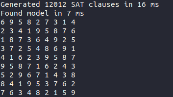

# Sudoku SAT solver

Simple sudoku solver using a SAT solver under the hood. 

Just a little spare time project so far - to learn more about using SAT solvers and reducing to NP-complete problems.

Most of the logic of reducing sudoku to SAT has been developed using TDD. The rules of a 9x9 sudoku reduce to 11988 SAT clauses using 729 variables (9 for each cell). Furthermore a clause is added for each of the preexisting numbers that make up the puzzle.  

## Example

