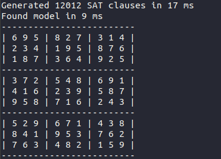
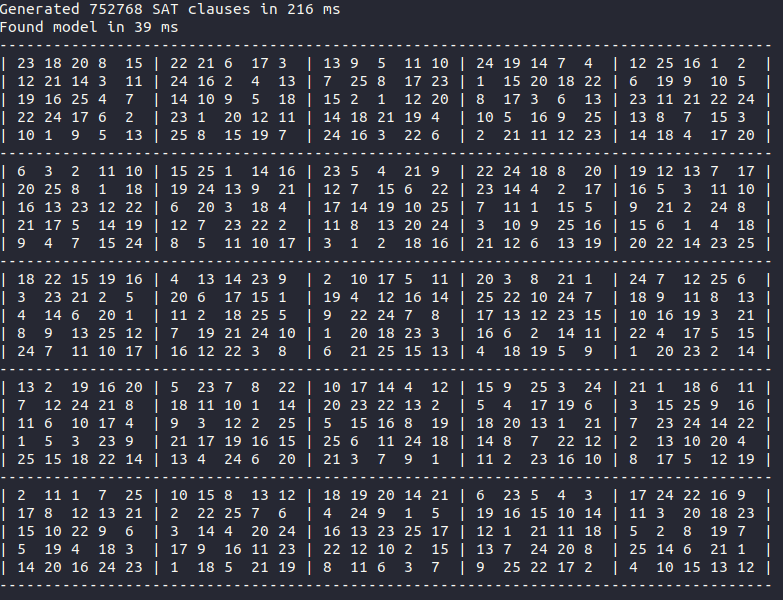

# Sudoku SAT solver

Simple sudoku solver using a SAT solver under the hood. 

Just a little spare time project so far - to learn more about using SAT solvers and reducing to NP-complete problems.

Most of the logic of reducing sudoku to SAT has been developed using TDD. The rules of a 9x9 sudoku reduce to 11988 SAT clauses using 729 variables (9 for each cell). Furthermore a clause is added for each of the preexisting numbers that make up the puzzle.  

Input can be any valid sudoku (length and width are equally big and are perfect squares, for example 9x9, 16x16, 25x25 etc.).

## Examples
### 9 x 9
Using the [9 x 9 example](example_9x9.txt) text file as input:
```
java -jar sat-sudoku-1.0.jar example_9x9.txt
```

### 25 x 25 
Using the [25 x 25 example](example_25x25.txt) text file as input:
```
java -jar sat-sudoku-1.0.jar example_25x25.txt
```

